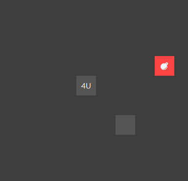

# Minesweeper Installer 🎮

A custom-built directional Minesweeper game with a modern setup wizard.

## Features
- Directional hints like `1L`, `2D`, etc.
- Professional installer with desktop shortcut and uninstall option (which doesen't work)

## How to Install
1. Download `MinesweeperSetup.exe` from the [Releases](https://github.com/rockbeatspaper-coder/minesweeper-installer/releases)
2. Run the installer

## Screenshots

## License
MIT (or whatever license you prefer)
